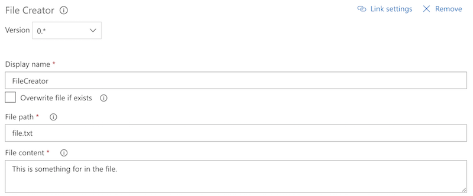

# File Creator

This is a task that can be used to create a file during a build or release process. With the task you can specify the file you want to create and its content.

## Options

### Overwrite file

This allows you to specify if you want to overwrite the file if it already exists. By default this is set to false.

### File path

With this property you can specify the path of the file including its name. Example: `folder/filename.txt`.

### File content

Specify the content of the file you want to add.

### Should file end with a new line

When this is checked, the task will automatically add a new line at the end the created file.

## Feedback

Feedback is always welcome. Please submit it via creating an issue in the repository [issue list](https://github.com/estruyf/vsts-file-creator/issues).